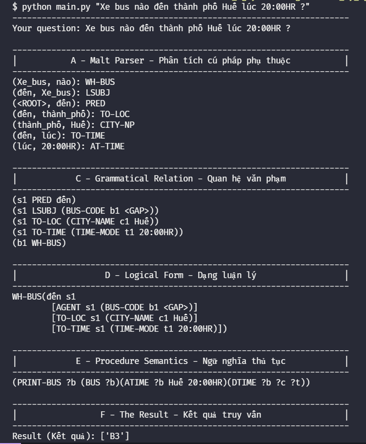

# NLP202_Assignment

Dự án của bộ môn Xử lý ngôn ngữ tự nhiên, đây là một hệ thống hỏi đáp đơn giản về các chuyến xe bus liên tỉnh bằng Quan hệ văn phạm

## Cơ sở dữ liệu

| Bus | Depart - Desination | DTIME | ATIME | RUN-TIME |
| --- | ------------------- | ----- | ----- | -------- |
| B1  | HCMC - HUE          | 10:00 | 19:00 | 9:00     |
| B2  | HCMC - HUE          | 14:30 | 22:30 | 8:00     |
| B3  | DANANG - HUE        | 16:00 | 20:00 | 4:00     |
| B4  | DANANG - HCMC       | 8:30  | 18:30 | 10:00    |
| B5  | DANANG - HN         | 5:30  | 23:30 | 18:00    |
| B6  | HUE - HN            | 6:30  | 22:30 | 16:00    |

## Cài đặt

Sử dụng package manager [pip](https://pip.pypa.io/en/stable/) để cài đặt thư viện [pyvi](https://pypi.org/project/pyvi/).

```bash
pip install pyvi
```

## Hướng dẫn sử dụng

Có 3 cách để sử dụng chương trình này

### Chọn ngẫu nhiên câu hỏi

Chương trình sẽ chọn ngẫu nhiên một câu hỏi có sẵn trong data để trả lời

```bash
python main.py
```

### Chọn câu hỏi trong data

Người dùng nhập input là một con số (vị trí [number]), khi đó chương trình sẽ lấy câu hỏi dự trên thứ tự của nó trong data. Nếu [number] không thỏa thì sẽ báo lỗi.

```bash
python main.py [number]
```

ví dụ

```bash
python main.py 3
```

### Tự nhập câu hỏi

Người dùng nhập input là một câu hỏi (vị trí [question]) và chương trình sẽ chạy dựa trên câu hỏi này. Nếu câu hỏi không thỏa thì sẽ ngưng báo lỗi trong lúc phân tích.

```bash
python main.py [question]
```

ví dụ

```bash
python main.py "Xe bus nào đến Hà Nội ?"
```

## Kết quả chạy chương trình

Lấy ví dụ, chạy chương trình bằng dòng lệnh sau

```bash
python main.py "Xe bus nào đến thành phố Huế lúc 20:00HR ?"
```

Chương trình sẽ chạy và xuất lần lượt các kết quả vào các file tương ứng.

Phân tích cú pháp phụ thuộc (file [output_a.txt](./Output/output_a.txt))

```text
(Xe_bus, nào): WH-BUS
(đến, Xe_bus): LSUBJ
(<ROOT>, đến): PRED
(đến, thành_phố): TO-LOC
(thành_phố, Huế): CITY-NP
(đến, lúc): TO-TIME
(lúc, 20:00HR): AT-TIME
```

Quan hệ văn phạm (file [output_c.txt](./Output/output_c.txt))

```text
(s1 PRED đến)
(s1 LSUBJ (BUS-CODE b1 <GAP>))
(s1 TO-LOC (CITY-NAME c1 Huế))
(s1 TO-TIME (TIME-MODE t1 20:00HR))
(b1 WH-BUS)
```

Dạng luận lý (file [output_d.txt](./Output/output_d.txt))

```text
WH-BUS(đến s1
	[AGENT s1 (BUS-CODE b1 <GAP>)]
	[TO-LOC s1 (CITY-NAME c1 Huế)]
	[TO-TIME s1 (TIME-MODE t1 20:00HR)])
```

Ngữ nghĩa thủ tục (file [output_e.txt](./Output/output_e.txt))

```text
(PRINT-BUS ?b (BUS ?b)(ATIME ?b Huế 20:00HR)(DTIME ?b ?c ?t))
```

Kết quả truy vấn (file [output_f.txt](./Output/output_f.txt))

```text
[B3]
```



## Các hình ảnh chạy thử khác

Kết quả khi chạy thử

```bash
python main.py "Thời gian xe bus B3 từ Đà Nẵng đến Huế ?"
```

!(Chạy thử "Thời gian xe bus B3 từ Đà Nẵng đến Huế ?")(./Images/Test_01.png)

Kết quả khi chạy thử

```bash
python main.py "Xe bus nào đến thành phố Hồ Chí Minh ?"
```

!(Chạy thử "Xe bus nào đến thành phố Hồ Chí Minh ?")(./Images/Test_02.png)

Kết quả khi chạy thử ngẫu nhiên

```bash
python main.py
```

!(Chạy thử random)(./Images/Test_03.png)
